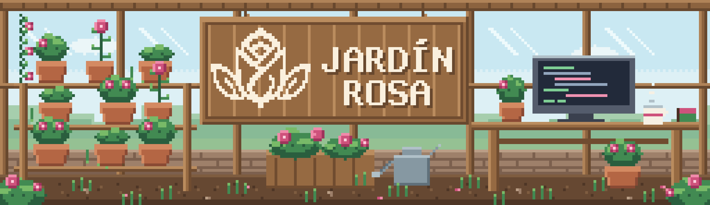

  <picture>
    <source media="(prefers-color-scheme: dark)" srcset="assets/cabecera-oscuro-animada.gif">
    <source media="(prefers-color-scheme: light)" srcset="assets/cabecera-claro-animada.gif">
    
  </picture>

# Pablo Delgado

Desarrollador de software en Ciudad de Panamá. Estoy en la etapa de
construir mis propios proyectos: lo que estudio lo llevo a código, y lo que
termino lo publico aquí.

**Jardín Rosa** es el nombre con el que firmo ese trabajo.

  

## En qué estoy ahora

- Desarrollador de **C#** y **ASP.NET Core** para construir aplicaciones web.
- Desarrollando proyectos personales para practicar lo que aprendo.
- Este perfil va a ir creciendo conforme tenga proyectos listos para mostrar.

## Contacto

- LinkedIn: [pablodelgado-dev](https://www.linkedin.com/in/pablodelgado-dev/)
